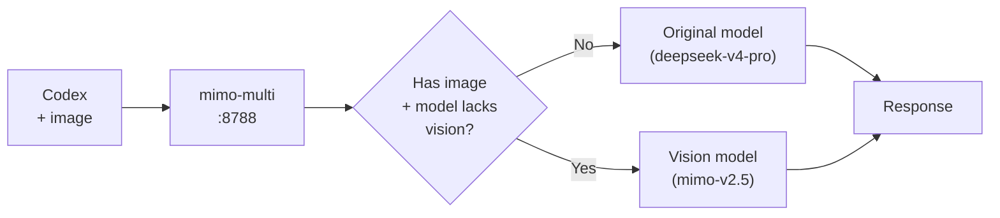

# mimo-multi

<p align="center">
  <a href="./README.md"><strong>English</strong></a> ·
  <a href="./README.zh.md">简体中文</a>
</p>

<p align="center">
  
  
  
  
  
</p>

**Enhanced fork of [mimo2codex](https://github.com/7as0nch/mimo2codex) with automatic visual fallback.**

When you send an image to a non-vision model (e.g., `deepseek-v4-pro`), mimo-multi auto-detects it and seamlessly switches to a vision model — no errors, no manual switching.



> Based on mimo2codex v0.5.5 by [7as0nch](https://github.com/7as0nch). All credit for the core proxy goes to the original author. This fork adds one killer feature: **visual fallback**.

## Visual Fallback

The problem: powerful models like `deepseek-v4-pro` don't support images. Send a photo → `404` error. You had to manually switch models — annoying.

mimo-multi fixes this transparently. When the proxy detects an image in a request to a non-vision model, it automatically reroutes to an available vision model:

```
[visual-fallback] deepseek-v4-pro → mimo-v2.5 (image detected)
```

- **Capability-based routing** — reads `supportsImages` flag, not hardcoded lists
- **Same-provider first** — MiMo pro → `mimo-v2.5`; cross-provider as fallback
- **Zero config** — no flags, no settings
- **Log visible** — `[visual-fallback]` in proxy logs when it fires

## Install

Three ways to install — pick the one that fits you best.

### Docker (One-Click)

No Node.js, no git clone. Just Docker and your API keys.

```bash
docker run -d -p 8788:8788 \
  -e MIMO_API_KEY=your-mimo-api-key \
  -e DS_API_KEY=your-deepseek-api-key \
  yvesnihaohaode/mimo-multi:latest
```

Admin UI at `http://localhost:8788/admin`.  
Docker Hub: [yvesnihaohaode/mimo-multi](https://hub.docker.com/repository/docker/yvesnihaohaode/mimo-multi)

### Auto Setup (Recommended for Local Dev)

One command sets up everything — no manual file editing.

```bash
npx mimo-multi setup
```

The wizard asks you for your API key and model preference, then writes `~/.codex/auth.json` and `~/.codex/config.toml` automatically — no JSON/TOML editing, no typos, no formatting errors.

Then start the proxy:

```bash
export MIMO_API_KEY=your-mimo-api-key
mimo-multi --port 8788
```

Open Codex and start chatting. Send an image and watch the proxy logs for `[visual-fallback]`.

### Manual (5 Steps)

<details>
<summary>For full control — click to expand</summary>

### 1. Get a MiMo API Key

Go to [MiMo Console](https://platform.xiaomimimo.com) → API Keys → copy your key (`sk-` or `tp-` prefix).

### 2. Install

```bash
npm install -g mimo-multi
```

Requires Node.js >= 18.

### 3. Start the proxy

```bash
export MIMO_API_KEY=your-mimo-api-key
mimo-multi
```

The startup banner prints two config snippets for Codex.

### 4. Configure Codex

Write the printed snippets to:

| File | macOS / Linux path |
|------|--------------------|
| auth.json | `~/.codex/auth.json` |
| config.toml | `~/.codex/config.toml` |

Example:

**~/.codex/auth.json**
```json
{"OPENAI_API_KEY": "mimo-multi-local"}
```

**~/.codex/config.toml**
```toml
model = "mimo-v2.5-pro"
model_provider = "mimo"

[model_providers.mimo]
name = "MiMo (via mimo-multi)"
base_url = "http://127.0.0.1:8788/v1"
wire_api = "responses"
requires_openai_auth = true
```

### 5. Run Codex

```bash
codex
# or open the Codex desktop app
```

Send an image and watch the proxy logs for `[visual-fallback]` — no manual steps needed.

</details>

For full documentation on all features (multi-provider, Docker, admin UI, generic providers, cc-switch integration, etc.), see the [upstream mimo2codex docs](https://github.com/7as0nch/mimo2codex).

## Difference from upstream mimo2codex

| | mimo2codex | mimo-multi |
|---|---|---|
| Non-vision model + image | Strips image, adds placeholder text | **Auto-switches to vision model** |
| Vision model + image | Works normally | Works normally |
| Manual model switching | Required for images | Not needed |

## Upstream Sync

This fork tracks upstream automatically via GitHub Actions (`.github/workflows/sync-upstream.yml`):

- Daily check for new mimo2codex releases
- Auto-merge when no conflicts with our visual-fallback patch
- Creates an issue if `src/server.ts` has merge conflicts (rare — we only patch ~20 lines)

## License

MIT — see [LICENSE](./LICENSE). Based on [mimo2codex](https://github.com/7as0nch/mimo2codex) by [7as0nch](https://github.com/7as0nch).
