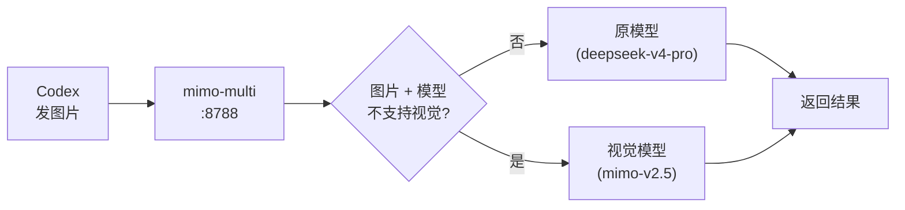

# mimo-multi · 中文文档

<p align="center">
  <a href="./README.md">English</a> ·
  <a href="./README.zh.md"><strong>简体中文</strong></a>
</p>

<p align="center">
  
  
  
  
</p>

**[mimo2codex](https://github.com/7as0nch/mimo2codex) 的增强 fork，核心功能：视觉回退。**

当你给不支持视觉的模型（如 `deepseek-v4-pro`）发图片时，mimo-multi 自动检测并切换到视觉模型——不会报错、不用手动切。



> 基于 mimo2codex v0.5.5，原作者 [7as0nch](https://github.com/7as0nch)。核心代理的所有功劳归于原作者。本 fork 只加了一个杀手级功能：**视觉回退**。

## 视觉回退

很多强大模型（如 `deepseek-v4-pro`）不支持图片。发张图就报 `404`，以前得手动切模型——烦人。

mimo-multi 把它做成透明的。代理检测到非视觉模型收到图片时，自动路由到可用的视觉模型：

```
[visual-fallback] deepseek-v4-pro → mimo-v2.5 (image detected)
```

- **能力路由** — 读取 `supportsImages` 字段，非硬编码
- **同 provider 优先** — MiMo pro → `mimo-v2.5`；必要时跨 provider
- **零配置** — 开箱即用
- **日志可见** — 代理日志显示 `[visual-fallback]`

## 安装

三种方式任选，各取所需。

### Docker（一键使用）

不需要 Node.js，不用 clone 代码，有 Docker 就能跑。

```bash
docker run -d -p 8788:8788 \
  -e MIMO_API_KEY=你的MiMo密钥 \
  -e DS_API_KEY=你的DeepSeek密钥 \
  yvesnihaohaode/mimo-multi:latest
```

管理界面：`http://localhost:8788/admin`  
Docker Hub：[yvesnihaohaode/mimo-multi](https://hub.docker.com/repository/docker/yvesnihaohaode/mimo-multi)

### 自动安装（推荐本地开发）

一条命令完成所有配置，无需手动编辑文件。

```bash
npx mimo-multi setup
```

配置向导会依次询问 API Key 和模型偏好，自动生成 `~/.codex/auth.json` 和 `~/.codex/config.toml`——不用手写 JSON/TOML，不会打错字、不会格式错误。

然后启动：

```bash
export MIMO_API_KEY=你的MiMo密钥
mimo-multi --port 8788
```

打开 Codex 就能用了。发张图试试，代理日志里会看到 `[visual-fallback]`。

### 手动安装（5 步）

<details>
<summary>想完全掌控每一步 — 点击展开</summary>

### 1. 获取 MiMo API Key

前往 [MiMo 控制台](https://platform.xiaomimimo.com) → API Keys → 复制 key（`sk-` 或 `tp-` 开头）。

### 2. 安装

```bash
npm install -g mimo-multi
```

需要 Node.js >= 18。

### 3. 启动代理

```bash
export MIMO_API_KEY=你的MiMo密钥
mimo-multi
```

启动成功后会打印两段配置内容，分别对应 Codex 的两个配置文件。

### 4. 配置 Codex

把启动横幅打印的内容写到对应文件：

| 文件 | macOS / Linux 路径 |
|------|--------------------|
| auth.json | `~/.codex/auth.json` |
| config.toml | `~/.codex/config.toml` |

示例配置：

**~/.codex/auth.json**
```json
{"OPENAI_API_KEY": "mimo-multi-local"}
```

**~/.codex/config.toml**
```toml
model = "mimo-v2.5-pro"
model_provider = "mimo"

[model_providers.mimo]
name = "MiMo (via mimo-multi)"
base_url = "http://127.0.0.1:8788/v1"
wire_api = "responses"
requires_openai_auth = true
```

### 5. 启动 Codex

```bash
codex
# 或在桌面端应用中打开
```

之后发图片就会看到代理日志中的 `[visual-fallback]` 提示，无需任何手动操作。

</details>

完整功能文档（多 provider、Docker、Admin UI、通用 provider、cc-switch 集成等）详见[上游 mimo2codex 文档](https://github.com/7as0nch/mimo2codex)。

## 使用方式

**重要：** 必须先启动 mimo-multi，再打开 Codex。电脑重启后 mimo-multi 不会自动运行——如果直接点开 Codex，它会往 `localhost:8788` 发请求但连不上。

### 方式一：手动启动（两步）

```bash
# 第一步 — 启动代理
export MIMO_API_KEY=你的MiMo密钥
mimo-multi --port 8788 &

# 第二步 — 打开 Codex（桌面 App 或终端输入 codex）
```

### 方式二：一键启动 + 切换模型（推荐）

在 `~/.zshrc`（或 `~/.bashrc`）中添加以下内容。先设置 API 密钥环境变量：

```bash
export MIMO_API_KEY=你的MiMo密钥
export DS_API_KEY=你的DeepSeek密钥
```

然后添加启动命令：

```bash
codex-mimo() {
  curl -s http://127.0.0.1:8788/admin/ > /dev/null 2>&1 || { MIMO_API_KEY=$MIMO_API_KEY DS_API_KEY=$DS_API_KEY mimo-multi --port 8788 & sleep 3; }
  sed -i "" "s/^model = .*/model = \"mimo-v2.5-pro\"/" ~/.codex/config.toml
  pkill -x Codex 2>/dev/null; sleep 1; open /Applications/Codex.app
  echo "→ mimo-v2.5-pro"
}

codex-ds() {
  curl -s http://127.0.0.1:8788/admin/ > /dev/null 2>&1 || { MIMO_API_KEY=$MIMO_API_KEY DS_API_KEY=$DS_API_KEY mimo-multi --port 8788 & sleep 3; }
  sed -i "" "s/^model = .*/model = \"deepseek-v4-pro\"/" ~/.codex/config.toml
  pkill -x Codex 2>/dev/null; sleep 1; open /Applications/Codex.app
  echo "→ deepseek-v4-pro"
}
```

之后一条命令搞定一切：

```bash
codex-mimo    # 启动代理 + 切到 mimo-v2.5-pro + 打开 Codex
codex-ds      # 启动代理 + 切到 deepseek-v4-pro + 打开 Codex
```

每条命令自动做三件事：**(1)** 如果 mimo-multi 没在运行就启动它，**(2)** 切换 `config.toml` 中的模型名，**(3)** 重启 Codex。电脑重启后，只需输入 `codex-mimo` 或 `codex-ds` 就能直接开始用。

## 与上游 mimo2codex 的区别

| | mimo2codex | mimo-multi |
|---|---|---|
| 非视觉模型 + 图片 | 丢弃图片，替换为占位文本 | **自动切换到视觉模型** |
| 视觉模型 + 图片 | 正常工作 | 正常工作 |
| 手动切模型 | 图片场景需要手动 | 不需要 |

## 上游同步

本 fork 通过 GitHub Actions（`.github/workflows/sync-upstream.yml`）自动跟踪上游更新：

- 每天检测一次 mimo2codex 新版本
- 与视觉回退补丁无冲突时自动合并
- 若 `src/server.ts` 出现冲突则自动创建 Issue（概率极低——仅改动约 20 行代码）

## 许可证

MIT，见 [LICENSE](./LICENSE)。基于 [7as0nch](https://github.com/7as0nch) 的 [mimo2codex](https://github.com/7as0nch/mimo2codex)。
